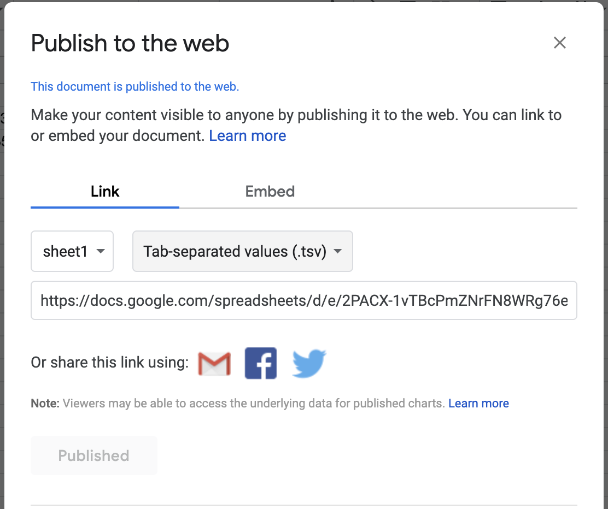

# s

a storytelling helper

## Purpose

The aim of this repository is to make `index.html` of mapbox/storytelling app simple as below.

## Examples

### Add YAML data into html file directly.

```html
<!DOCTYPE html><html><head><meta charset="utf-8"><meta name="viewport" content="width=device-width">
<title></title>
<script type="module" src="https://optgeo.github.io/s/module.js"></script>
<script type="module" src="https://optgeo.github.io/s/storytelling.js"></script>
</head>
<body>
<script type="text/yaml">
accessToken: pk.eyJ1IjoiaGZ1IiwiYSI6ImlRSGJVUTAifQ.rTx380smyvPc1gUfZv1cmw
title: 中国地方の自然と産業
style: https://optgeo.github.io/b3p/style.json
chapters:
  -
    title: 岡山平野
    description: 岡山県にある平野です。
    hash: 11.19/34.5801/133.8456/63.2/59
  -
    title: 鳥取砂丘
    description: 鳥取県にある砂丘です。
    hash: 14.9/35.54016/134.22845/153.6/0
footer: >-
  <p>このプロジェクトは、
  <a href='https://github.com/optgeo'>Adopt Geodata プロジェクト</a>の一環です。</p>
</script>
</body>
</html>
```

[Example](examples/index.html)

### Import data from Google Spreadsheet

Please create google spreadsheet and publish it as a `tsv` format data by using `File -> Publish to the web`
The spreadsheet should have `title`, `description` and `hash` columns.
[Example Spreadsheet](https://docs.google.com/spreadsheets/d/1Kt2ZjySNaNfeeiMPLjto1nvH7ue4BoQfuxtZ5c4oZV0/edit#gid=0)



Then specify the published URL to the `chapters` property on the HTML file.

```html
<!DOCTYPE html><html><head><meta charset="utf-8"><meta name="viewport" content="width=device-width">
<title></title>
<script type="module" src="https://optgeo.github.io/s/module.js"></script>
<script type="module" src="https://optgeo.github.io/s/storytelling.js"></script>
<script type="module" src="https://optgeo.github.io/s/gspreadsheet.js"></script>
</head>
<body>
<script type="text/yaml">
accessToken: pk.eyJ1IjoiaGZ1IiwiYSI6ImlRSGJVUTAifQ.rTx380smyvPc1gUfZv1cmw
title: 中国地方の自然と産業
style: https://optgeo.github.io/b3p/style.json
chapters: https://docs.google.com/spreadsheets/d/e/2PACX-1vTBcPmZNrFN8WRg76eKJXwnNQDFh-G0sG2OcwJ00hW1DxNKgxZnGAlYzZoiZJktiCB1Zr1wrxJiqbjU/pub?output=tsv
footer: >-
  <p>このプロジェクトは、
  <a href='https://github.com/optgeo'>Adopt Geodata プロジェクト</a>の一環です。</p>
</script>
</body>
</html>
```

[Example](examples/spreadsheet.html) or [Demo](https://optgeo.github.io/b3ps7/)

## Thanks

- https://github.com/mapbox/storytelling
- @taisukef
- @halsk

## Demo

- https://optgeo.github.io/s/

